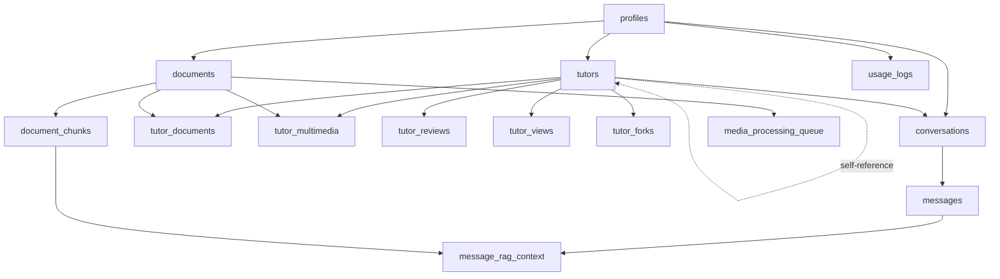

# 🗄️ Database Schema Documentation

**Last Updated**: November 2025  
**Database**: PostgreSQL (Supabase)  
**Schema Version**: 1.0

---

## 📊 Overview

This document provides a comprehensive overview of the database schema for **AI Knowledge Companion**. The database uses PostgreSQL with Supabase and includes advanced features like:

- 🔍 **Vector Search** (pgvector for embeddings)
- 🔐 **Row Level Security** (RLS)
- 🔄 **Triggers** for automated workflows
- 📈 **Real-time subscriptions**

---

## 📋 Table of Contents

1. [Tables Overview](#tables-overview)
2. [Core Tables](#core-tables)
3. [Junction Tables](#junction-tables)
4. [Analytics & Tracking](#analytics--tracking)
5. [Foreign Key Relationships](#foreign-key-relationships)
6. [Current Database State](#current-database-state)
7. [Data Examples](#data-examples)

---

## Tables Overview

### Summary

| Table | Records | Purpose |
|-------|---------|---------|
| `profiles` | 4 | User profiles and roles |
| `documents` | 12 | Documents and multimedia files |
| `tutors` | 8 | AI tutors configuration |
| `conversations` | 37 | Chat conversations |
| `messages` | 82 | Chat messages |
| `document_chunks` | 14 | Document embeddings for RAG |
| `message_rag_context` | 23 | RAG context for messages |
| `tutor_documents` | 9 | Tutor-Document links |
| `tutor_multimedia` | 0 | Tutor-Multimedia links |
| `tutor_reviews` | 1 | Marketplace reviews |
| `tutor_views` | 0 | Tutor view tracking |
| `usage_logs` | 17 | API usage tracking |

### All Tables

```sql
-- Core Data Tables
profiles                    -- User profiles, roles, subscription
documents                   -- Documents and multimedia files
tutors                      -- AI tutor configurations
conversations               -- Chat conversations
messages                    -- Chat messages

-- Junction Tables
tutor_documents             -- Many-to-many: tutors ↔ documents
tutor_multimedia            -- Many-to-many: tutors ↔ multimedia
tutor_forks                 -- Tutor forking relationships

-- Embeddings & RAG
document_chunks             -- Document chunks with vector embeddings
message_rag_context         -- RAG context per message

-- Analytics & Marketplace
tutor_reviews               -- Marketplace reviews
tutor_views                 -- Tutor view tracking
usage_logs                  -- API usage and costs

-- Billing & Subscriptions
subscription_plans          -- Available subscription tiers
user_subscriptions          -- User subscription state
billing_periods             -- Billing cycle tracking
user_quotas                 -- Usage quotas per user
usage_alerts                -- Quota alerts

-- Processing & Queue
media_processing_queue      -- Async multimedia processing

-- Admin
admin_audit_log             -- Admin action tracking
```

---

## Core Tables

### 1. `documents`

**Purpose**: Stores all uploaded files (documents, audio, video, images)

```sql
CREATE TABLE documents (
  id                    UUID PRIMARY KEY DEFAULT uuid_generate_v4(),
  owner_id              UUID NOT NULL,              -- FK to profiles
  title                 TEXT NOT NULL,
  description           TEXT,
  source_url            TEXT,
  storage_path          TEXT NOT NULL,
  mime_type             TEXT NOT NULL,
  file_size             BIGINT,
  length_tokens         INTEGER DEFAULT 0,
  visibility            TEXT DEFAULT 'private',     -- private | public
  status                TEXT DEFAULT 'processing',  -- processing | ready | error
  media_type            TEXT DEFAULT 'document',    -- document | audio | video | image
  
  -- Multimedia-specific fields
  duration_seconds      INTEGER,                    -- For audio/video
  width                 INTEGER,                    -- For images/video
  height                INTEGER,                    -- For images/video
  thumbnail_url         TEXT,
  
  -- Transcription fields
  transcription_status  TEXT DEFAULT 'pending',     -- pending | processing | completed | error
  transcription_text    TEXT,
  transcription_cost    NUMERIC,
  
  created_at            TIMESTAMPTZ DEFAULT NOW(),
  updated_at            TIMESTAMPTZ DEFAULT NOW()
);
```

**Media Types**:
- `document`: PDF, TXT, MD, DOCX
- `audio`: MP3, WAV, M4A, OGG, AAC, WebM
- `video`: MP4, MOV, AVI, WebM
- `image`: JPG, PNG, GIF, WebP

---

### 2. `tutors`

**Purpose**: AI tutor configurations and marketplace data

```sql
CREATE TABLE tutors (
  id                      UUID PRIMARY KEY DEFAULT gen_random_uuid(),
  owner_id                UUID NOT NULL,              -- FK to profiles
  name                    VARCHAR NOT NULL,
  description             TEXT,
  avatar_url              TEXT,
  
  -- AI Configuration
  system_prompt           TEXT NOT NULL DEFAULT 'You are a helpful AI tutor...',
  temperature             NUMERIC DEFAULT 0.7,
  max_tokens              INTEGER DEFAULT 2000,
  model                   VARCHAR DEFAULT 'gpt-4o-mini',  -- gpt-4o-mini | gpt-4 | gpt-4-turbo
  
  -- RAG Configuration
  use_rag                 BOOLEAN DEFAULT true,
  max_context_chunks      INTEGER DEFAULT 5,
  similarity_threshold    NUMERIC DEFAULT 0.7,
  
  -- Document Restrictions
  allowed_document_types  TEXT[] DEFAULT ARRAY['pdf', 'txt', 'md', 'doc', 'docx'],
  max_document_size_mb    INTEGER DEFAULT 10,
  
  -- Visibility & Sharing
  visibility              VARCHAR DEFAULT 'private',  -- private | unlisted | marketplace
  is_shared               BOOLEAN DEFAULT false,
  share_token             VARCHAR,
  
  -- Statistics
  total_conversations     INTEGER DEFAULT 0,
  total_messages          INTEGER DEFAULT 0,
  total_tokens_used       INTEGER DEFAULT 0,
  last_used_at            TIMESTAMPTZ,
  
  -- Marketplace Fields
  price                   NUMERIC DEFAULT 0.00,
  is_free                 BOOLEAN DEFAULT true,
  downloads_count         INTEGER DEFAULT 0,
  forks_count             INTEGER DEFAULT 0,
  rating_average          NUMERIC DEFAULT 0.00,
  reviews_count           INTEGER DEFAULT 0,
  category                TEXT,                       -- mathematics | science | language | programming | history | other
  tags                    TEXT[] DEFAULT '{}',
  featured                BOOLEAN DEFAULT false,
  original_tutor_id       UUID,                       -- FK to tutors (for forks)
  
  created_at              TIMESTAMPTZ DEFAULT NOW(),
  updated_at              TIMESTAMPTZ DEFAULT NOW()
);
```

**Visibility Levels**:
- `private`: Only owner can access
- `unlisted`: Anyone with link can access
- `marketplace`: Listed in public marketplace

**Models Supported**:
- `gpt-4o-mini`: Fast, cost-effective
- `gpt-4`: Most capable
- `gpt-4-turbo`: Balance of speed and capability

---

### 3. `conversations`

**Purpose**: Chat conversation sessions

```sql
CREATE TABLE conversations (
  id                UUID PRIMARY KEY DEFAULT gen_random_uuid(),
  user_id           UUID NOT NULL,              -- FK to profiles
  tutor_id          UUID NOT NULL,              -- FK to tutors
  title             VARCHAR NOT NULL DEFAULT 'New Conversation',
  
  -- Statistics
  message_count     INTEGER DEFAULT 0,
  last_message_at   TIMESTAMPTZ DEFAULT NOW(),
  
  -- State
  is_archived       BOOLEAN DEFAULT false,
  metadata          JSONB DEFAULT '{}',
  
  created_at        TIMESTAMPTZ DEFAULT NOW(),
  updated_at        TIMESTAMPTZ DEFAULT NOW()
);
```

---

### 4. `messages`

**Purpose**: Individual chat messages

```sql
CREATE TABLE messages (
  id                  UUID PRIMARY KEY DEFAULT gen_random_uuid(),
  conversation_id     UUID NOT NULL,              -- FK to conversations
  role                VARCHAR NOT NULL,           -- user | assistant | system
  sender              TEXT NOT NULL DEFAULT 'user',
  content             TEXT NOT NULL,
  
  -- AI Metadata
  model               VARCHAR,                    -- Model used for generation
  temperature         NUMERIC,
  tokens_used         INTEGER DEFAULT 0,
  
  metadata            JSONB DEFAULT '{}',
  created_at          TIMESTAMPTZ DEFAULT NOW()
);
```

---

### 5. `document_chunks`

**Purpose**: Document chunks with vector embeddings for RAG

```sql
CREATE TABLE document_chunks (
  id            UUID PRIMARY KEY DEFAULT uuid_generate_v4(),
  document_id   UUID NOT NULL,              -- FK to documents
  chunk_index   INTEGER NOT NULL,
  text          TEXT NOT NULL,
  tokens        INTEGER NOT NULL,
  embedding     VECTOR(1536),               -- OpenAI ada-002 embeddings
  created_at    TIMESTAMPTZ DEFAULT NOW()
);

-- Index for fast similarity search
CREATE INDEX ON document_chunks USING ivfflat (embedding vector_cosine_ops);
```

**Vector Search**:
- Uses `pgvector` extension
- 1536 dimensions (OpenAI `text-embedding-ada-002`)
- Cosine similarity for retrieval

---

## Junction Tables

### 1. `tutor_documents`

**Purpose**: Links tutors to documents (many-to-many)

```sql
CREATE TABLE tutor_documents (
  id              UUID PRIMARY KEY DEFAULT uuid_generate_v4(),
  tutor_id        UUID NOT NULL,              -- FK to tutors
  document_id     UUID NOT NULL,              -- FK to documents
  display_order   INTEGER DEFAULT 0,
  created_at      TIMESTAMPTZ DEFAULT NOW(),
  updated_at      TIMESTAMPTZ DEFAULT NOW(),
  
  UNIQUE(tutor_id, document_id)
);
```

---

### 2. `tutor_multimedia`

**Purpose**: Links tutors to multimedia files (many-to-many)

```sql
CREATE TABLE tutor_multimedia (
  id              UUID PRIMARY KEY DEFAULT uuid_generate_v4(),
  tutor_id        UUID NOT NULL,              -- FK to tutors
  document_id     UUID NOT NULL,              -- FK to documents (multimedia)
  display_order   INTEGER DEFAULT 0,
  created_at      TIMESTAMPTZ DEFAULT NOW(),
  updated_at      TIMESTAMPTZ DEFAULT NOW(),
  
  UNIQUE(tutor_id, document_id)
);
```

---

### 3. `message_rag_context`

**Purpose**: Links messages to document chunks used for RAG

```sql
CREATE TABLE message_rag_context (
  id              UUID PRIMARY KEY,
  message_id      UUID NOT NULL,              -- FK to messages
  chunk_id        UUID NOT NULL,              -- FK to document_chunks
  similarity      NUMERIC,                    -- Similarity score
  created_at      TIMESTAMPTZ DEFAULT NOW()
);
```

---

## Analytics & Tracking

### 1. `usage_logs`

**Purpose**: Tracks API usage and costs per operation

```sql
CREATE TABLE usage_logs (
  id                UUID PRIMARY KEY DEFAULT gen_random_uuid(),
  user_id           UUID NOT NULL,              -- FK to profiles
  action            TEXT NOT NULL,              -- chat | embedding | transcription | vision
  tokens_used       INTEGER,
  cost_estimate     NUMERIC,
  metadata          JSONB,                      -- Operation-specific details
  created_at        TIMESTAMPTZ DEFAULT NOW()
);
```

**Action Types**:
- `chat`: GPT chat completions
- `embedding`: Document embedding generation
- `transcription`: Whisper audio transcription
- `vision`: GPT-4V image analysis

---

### 2. `tutor_reviews`

**Purpose**: Marketplace tutor reviews

```sql
CREATE TABLE tutor_reviews (
  id              UUID PRIMARY KEY DEFAULT gen_random_uuid(),
  tutor_id        UUID NOT NULL,              -- FK to tutors
  user_id         UUID NOT NULL,              -- FK to profiles
  rating          INTEGER NOT NULL,           -- 1-5
  comment         TEXT,
  created_at      TIMESTAMPTZ DEFAULT NOW(),
  
  UNIQUE(tutor_id, user_id)                   -- One review per user per tutor
);
```

---

### 3. `tutor_views`

**Purpose**: Tracks tutor page views

```sql
CREATE TABLE tutor_views (
  id              UUID PRIMARY KEY DEFAULT gen_random_uuid(),
  tutor_id        UUID NOT NULL,              -- FK to tutors
  user_id         UUID,                       -- Optional: anonymous views
  created_at      TIMESTAMPTZ DEFAULT NOW()
);
```

---

## Foreign Key Relationships

### Complete Relationship Map



### Foreign Key Constraints

| From Table | Column | To Table | Column | Constraint Name |
|------------|--------|----------|--------|-----------------|
| `conversations` | `tutor_id` | `tutors` | `id` | `conversations_tutor_id_fkey` |
| `document_chunks` | `document_id` | `documents` | `id` | `document_chunks_document_id_fkey` |
| `media_processing_queue` | `document_id` | `documents` | `id` | `media_processing_queue_document_id_fkey` |
| `message_rag_context` | `chunk_id` | `document_chunks` | `id` | `message_rag_context_chunk_id_fkey` |
| `message_rag_context` | `message_id` | `messages` | `id` | `message_rag_context_message_id_fkey` |
| `messages` | `conversation_id` | `conversations` | `id` | `messages_conversation_id_fkey` |
| `tutor_documents` | `document_id` | `documents` | `id` | `tutor_documents_document_id_fkey` |
| `tutor_documents` | `tutor_id` | `tutors` | `id` | `tutor_documents_tutor_id_fkey` |
| `tutor_forks` | `forked_tutor_id` | `tutors` | `id` | `tutor_forks_forked_tutor_id_fkey` |
| `tutor_forks` | `original_tutor_id` | `tutors` | `id` | `tutor_forks_original_tutor_id_fkey` |
| `tutor_multimedia` | `document_id` | `documents` | `id` | `tutor_multimedia_document_id_fkey` |
| `tutor_multimedia` | `tutor_id` | `tutors` | `id` | `tutor_multimedia_tutor_id_fkey` |
| `tutor_reviews` | `tutor_id` | `tutors` | `id` | `tutor_reviews_tutor_id_fkey` |
| `tutor_views` | `tutor_id` | `tutors` | `id` | `tutor_views_tutor_id_fkey` |
| `tutors` | `original_tutor_id` | `tutors` | `id` | `tutors_original_tutor_id_fkey` |

---

## Current Database State

**As of**: November 2025

### Record Counts

| Table | Count | Notes |
|-------|-------|-------|
| `profiles` | 4 | 1 super_admin, 3 users |
| `documents` | 12 | Mixed: documents + multimedia |
| `tutors` | 8 | Including 2 forks |
| `conversations` | 37 | Active chat sessions |
| `messages` | 82 | Total messages sent |
| `document_chunks` | 14 | Embedded chunks for RAG |
| `message_rag_context` | 23 | RAG contexts used |
| `tutor_documents` | 9 | Tutor-document links |
| `tutor_multimedia` | 0 | No multimedia linked yet |
| `tutor_reviews` | 1 | Single marketplace review |
| `tutor_views` | 0 | View tracking not used yet |
| `usage_logs` | 17 | API operations logged |

---

## Data Examples

### Example Document

```json
{
  "id": "95a8cf5d-9484-4a1b-938b-6cf91ca0c605",
  "owner_id": "05237d7e-320d-45ba-9499-94ef49e3be89",
  "title": "Full-stack Web Developer CV - ENG",
  "media_type": "document",
  "status": "ready",
  "visibility": "private",
  "created_at": "2025-10-30T19:59:06.647605Z"
}
```

### Example Tutor

```json
{
  "id": "f0a154ae-08b2-4b40-b847-0ec85d1ec576",
  "owner_id": "05237d7e-320d-45ba-9499-94ef49e3be89",
  "name": "test",
  "description": "tutor di test",
  "visibility": "marketplace",
  "model": "gpt-4o-mini",
  "category": "mathematics",
  "tags": ["AI", "Learning", "Tutorial"],
  "featured": false,
  "created_at": "2025-10-28T19:05:38.172866Z"
}
```

### Example User Profiles

```json
[
  {
    "id": "06f91bd1-8ce7-4c96-a86f-77261f461370",
    "role": "super_admin",
    "status": "active",
    "created_at": "2025-11-08T02:19:33.140273Z"
  },
  {
    "id": "05237d7e-320d-45ba-9499-94ef49e3be89",
    "role": "user",
    "status": "active",
    "created_at": "2025-11-02T22:43:46.358318Z"
  }
]
```

---

## 🔐 Security Notes

### Row Level Security (RLS)

All tables have RLS policies enabled to ensure:
- Users can only access their own data
- Admins have elevated permissions
- Public marketplace tutors are visible to all
- Shared tutors (unlisted) accessible via share token

### Cascading Deletes

**Important**: Deleting records may cascade:
- Deleting a `document` → Deletes `document_chunks`
- Deleting a `tutor` → Deletes `conversations`, `tutor_documents`, etc.
- Deleting a `conversation` → Deletes `messages`

**Always backup before bulk deletions!**

---

## 📚 Related Documentation

- [SQL Migration Order](./SQL_MIGRATION_ORDER.md)
- [API Documentation](./API.md)
- [Supabase Setup](../setup/SUPABASE_SETUP.md)
- [Cost Tracking](../features/COST_TRACKING_UI_GUIDE.md)

---

## 🔄 Maintenance

### Vacuum & Analyze

Recommended periodic maintenance:

```sql
-- Analyze table statistics
ANALYZE documents;
ANALYZE tutors;
ANALYZE messages;
ANALYZE document_chunks;

-- Vacuum to reclaim space
VACUUM ANALYZE documents;
VACUUM ANALYZE document_chunks;
```

### Index Monitoring

```sql
-- Check index usage
SELECT 
    schemaname,
    tablename,
    indexname,
    idx_scan as index_scans,
    idx_tup_read as tuples_read,
    idx_tup_fetch as tuples_fetched
FROM pg_stat_user_indexes
WHERE schemaname = 'public'
ORDER BY idx_scan DESC;
```

---

**📝 Notes**: 
- This schema is production-ready as of November 2025
- pgvector extension required for embeddings
- Supabase handles auth and RLS automatically
- All timestamps are UTC (TIMESTAMPTZ)

